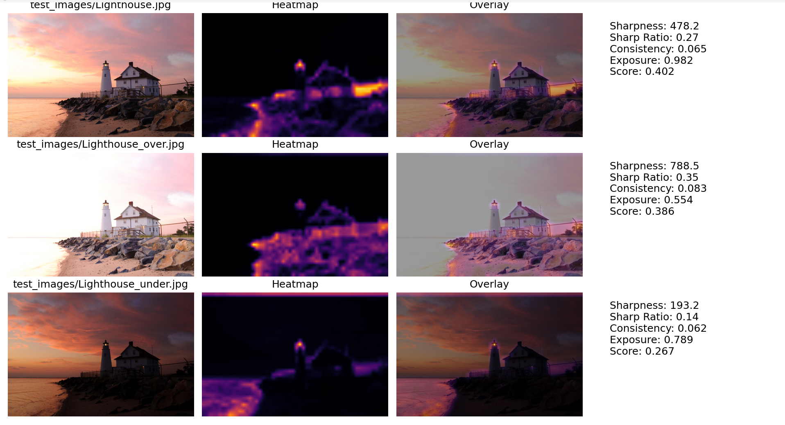

# Image-Quality-Analyzer

An image quality assessment tool that combines classical computer vision techniques with machine learning to evaluate image sharpness and classify images as Sharp or Blurry. 

*Image Quality Analyzer (v1)*

 Uses Laplacian variance for sharpness estimation, splits image into patches to generate heatmap, and visualizes sharpness distribution via overlay.
 
 A few terms to note:
  
 - Sharp Ratio: What fraction of the image is considered sharp.
 
 - Standard Deviation(Std): How spread out the values of the image patches are. (Low std means all are generally blurry/uniformly texture, while High std means there are clear focus areas.)

*Image Quality Analyzer (v2)*

In this upgraded version, we incorporated multi-image comparison, a consistency metric, and exposure awareness. By adding them together, we form a combined score for images which we can use to
rank them:

```python
score = (
    0.4 * norm_sharpness +
    0.25 * sharp_ratio +
    0.15 * consistency +
    0.2 * exposure
        )
```
Where:

- `norm_sharpness` measures global image sharpness using Laplacian variance.
- `sharp_ratio` measures the fraction of image patches considered sharp.
- `consistency` measures how evenly sharpness is distributed.
- `exposure` penalizes over- and under-exposed images



 Run:
python main.py image.jpg[replace with own image file]

*Image Quality Analyzer (v3)*

Now, we added a simple Machine Learning feature, known as the Random Forest Classifier. Along it, we have also introduced an additional sharpness parameter known as wavelets.

So what does each parameter do?

- `Laplacian Variance`: First parameter. Locally, it measures the difference in pixel intensity between neighboring pixels, and then outputs a single score globally through variance. 

- `FFT High Frequency Ratio`: Uses the Fast Fourier Transform (FFT) to measure the proportion of high-frequency information present across the entire image. Sharp images generally contain more high-frequency content than blurry images. 

- `Wavelet Energy Ratio`: Captures localized high frequency detail while preserving spatial information, allowing the algorithm to measure both the amount of fine detail and where it is located within the image.

- `Consistency`: Measures how evenly sharpness is distributed along image.

- `Exposure` : Penalizes under of overexposed images.

**Machine Learning Pipeline**

Version 3 introduces a supervised learning workflow:
1. We first manually label images as sharp or blurry.
2. The handcrafted features are extracted from each image.
3. A dataset is generated automatically.
4. A Random Forest Classifier is trained on the extracted features.
5. The trained model is saved as `model.pkl`.
6. New images are then classified automatically with prediction probabilities.

(Example Output)

Prediction          : Sharp 
Probability (Sharp) : 95% 
Probability (Blurry): 5%

___________________________________________________________

**Running the Project**
- Analyze and compare images
python main.py

- Generate a labelled dataset
python ml/generate_dataset.py

- Train the Random Forest model
python -m ml.train_model

- Predict image quality
python -m ml.predict
